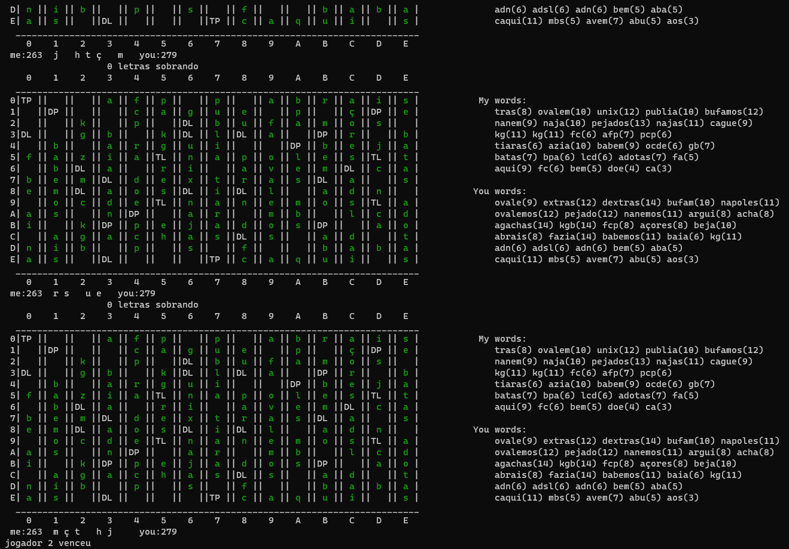

Scrabble  
================

### Descrição
Trabalho requerido pela disciplina de Projeto e Análise de Algoritmos, no qual deve-se refazer o jogo Scrabble e criar uma "IA" com algoritmos de força bruta e uma forma de armazenar as palavras para facilitar o acesso. 


Table of contents
=================
<!--ts-->
   * [Descrição](#Descrição)
   * [Table of contents](#tabela-de-conteudo)
   * [Usage](#Usage)
      * [Prerequisites](#prerequisites)
      * [Local Files](#local-files)
      * [Experimento](#experimento)
      * [Final](#final)
<!--te-->

# Usage

## Pré-requisitos

Somente é necessário ter instalado o python3.6 na sua máquina

## Local Files
Você pode executar o programa sem necessidade de colocar as suas próprias palavras. Caso queira adicionar seu próprio dicionário deve-se substituir o "BD/wordlist-big-latest.txt" pelo seu dicionário. Após isso deve se executar:

```
python3 mount.py
```

## Experimento
1. Para executar o jogo (coloque o terminal em tela cheia): 
```
$ python3 main.py
```

2. Informe os dois tipos de jogadores (coloque ambos máquina para forma automática):
```
Informe o tipo do jogador 1: m-maquina, h-humano:
```

## Final


